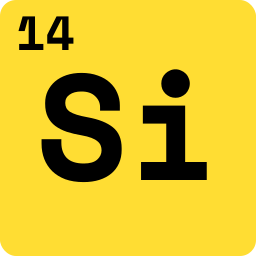

# sc-file

<!-- Links -->

[readme-en]: README.md
[pypi]: https://pypi.org/project/sc-file
[license]: https://opensource.org/licenses/MIT
[tests]: https://github.com/onejeuu/sc-file/actions/workflows/tests.yml
[build]: https://github.com/onejeuu/sc-file/actions/workflows/release.yml
[issues]: https://github.com/onejeuu/sc-file/issues
[releases]: https://github.com/onejeuu/sc-file/releases
[docs]: https://sc-file.readthedocs.io/ru/latest
[contact]: https://onejeuu.t.me

<!-- Usage -->

[usage-dragndrop]: https://ru.wikipedia.org/wiki/Drag-and-drop
[usage-defaultapp]: https://support.microsoft.com/ru-ru/windows/e5d82cad-17d1-c53b-3505-f10a32e1894d
[usage-cli]: https://ru.wikipedia.org/wiki/Интерфейс_командной_строки

<!-- Docs -->

[docs-usage]: https://sc-file.readthedocs.io/ru/latest/usage.html
[docs-faq]: https://sc-file.readthedocs.io/ru/latest/faq.html
[docs-support]: https://sc-file.readthedocs.io/ru/latest/support.html
[docs-compile]: https://sc-file.readthedocs.io/ru/latest/compile.html
[docs-library]: https://sc-file.readthedocs.io/ru/latest/api/index.html

<!-- Badges -->

[badge-pypi]: https://img.shields.io/pypi/v/sc-file.svg
[badge-license]: https://img.shields.io/github/license/onejeuu/sc-file
[badge-docs]: https://img.shields.io/readthedocs/sc-file
[badge-tests]: https://img.shields.io/github/actions/workflow/status/onejeuu/sc-file/tests.yml?label=tests
[badge-build]: https://img.shields.io/github/actions/workflow/status/onejeuu/sc-file/release.yml?label=build
[badge-issues]: https://img.shields.io/github/issues/onejeuu/sc-file



[![Pypi][badge-pypi]][pypi] [![License][badge-license]][license] [![Docs][badge-docs]][docs] [![Tests][badge-tests]][tests] [![Build][badge-build]][build] [![Issues][badge-issues]][issues]

🇬🇧 [English][readme-en] | 🇷🇺 **Русский**

## Обзор

**scfile** это утилита и библиотека для конвертации проприетарных форматов ассетов игры Stalcraft в стандартные.

> Данный проект является **неофициальным** и **не аффилирован** с EXBO.

## ✨ Поддерживаемые форматы

| Тип                | Игровые форматы         | →   | Стандартные форматы          |
| ------------------ | ----------------------- | --- | ---------------------------- |
| 🧊 **Модель**      | `.mcsb` `.mcsa` `.mcvd` | →   | `.glb` `.obj` `.dae` `.ms3d` |
| 🧱 **Текстура**    | `.ol`                   | →   | `.dds`                       |
| 🖼️ **Изображение** | `.mic`                  | →   | `.png`                       |
| 📦 **Архив**       | `.texarr`               | →   | `.zip`                       |
| ⚙️ **Данные**      | `NBT`\*                 | →   | `.json`                      |

\* `NBT` Относится к специфичным файлам (`itemnames.dat`, `prefs`, `sd0` и т.д.)

> [!IMPORTANT]  
> **Обратная конвертация (`стандартный` → `игровой`) недоступна.**  
> 📚 [Подробности в FAQ →][docs-faq]

</br>

> [!TIP]  
> 📚 [Детальная информация о поддержке форматов →][docs-support]

## 🚀 Быстрый старт

> **_Три способа начать:_** скачать, установить или скомпилировать.

### 1. 💻 Скачать исполняемый файл

Standalone `scfile.exe` доступен на [странице Releases][releases].  
_Не требует установки Python._

**Использование:**

- 📥 **Drag & Drop**: перетащите файл на `scfile.exe`  
   _[Что такое drag and drop?][usage-dragndrop]_
- 🖱️ **Открыть с помощью**: установите приложением по умолчанию для поддерживаемых форматов  
   _[Как установить приложение по умолчанию (Windows)?][usage-defaultapp]_
- 📟 **Командная строка**: `scfile.exe --help`  
   _[Что такое командный интерфейс?][usage-cli]_  
   _Пример:_ `scfile.exe model.mcsb -F glb --skeleton`  
   _Опции: `-F` выбирает формат модели, `--skeleton` извлекает скелет и кости._

### 2. 🐍 Установить Python пакет

**Установка:**

```bash
pip install sc-file
```

**Использование:**

- 📖 **Python библиотека**: [См. раздел Библиотека](#-библиотека)
- 📟 **CLI через пакет**: `scfile --help`

### 3. 🔧 Скомпилировать из исходников

Соберите из исходного кода, используя [руководство по сборке][docs-compile].  
_Для разработчиков, контрибьюторов или пользовательских сборок._

</br>

> [!TIP]  
> 📚 [Руководство по использованию и параметры CLI →][docs-usage]

## 📖 Библиотека

**Установите последнюю версию:**

```bash
pip install sc-file -U
```

**Пример использования:**

```py
from scfile import convert, formats, UserOptions

# Простая конвертация (автоопределение формата по расширению)
# Настройки пользователя для управления парсингом и экспортом
convert.auto("model.mcsb", options=UserOptions(parse_skeleton=True))

# Расширенное управление (ручное декодирование и просмотр данных)
# Контекстный менеджер обеспечивает корректное освобождение ресурсов
with formats.mcsb.McsbDecoder("model.mcsb") as mcsb:
    # Доступ к данным сцены: меши, кости и тд
    scene = mcsb.decode().scene
    print(f"Всего вершин в модели: {sum(m.count.vertices for m in scene.meshes)}")

    # Экспорт в конкретный стандартный формат
    mcsb.to_obj().save("output.obj")
```

</br>

> [!TIP]  
> 📚 [Полное описание API библиотеки →][docs-library]

## 🔗 Ссылки

- `📚` **Документация:** [sc-file.readthedocs.io][docs] (использование, параметры cli, форматы, api)
- `❓` **Есть вопросы?** Ознакомьтесь с [FAQ][docs-faq] или [свяжитесь со мной][contact]
- `🐛` **Нашли баг?** [Создайте issue][issues]
- `💻` **Скачать исполняемый файл:** [Последний релиз][releases]
- `🔧` **Скомпилировать из исходников:** [Руководство по сборке][docs-compile]

## 🤝 Благодарности

`kommunist2021` · `Art3mLapa` · `n1kodim`  
`IExploitableMan` · `Sarioga` · `Hazart`

Спасибо всем, кто сообщал об ошибках, делился находками или вносил идеи.
