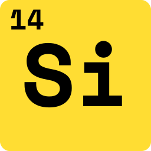

# sc-file

<!-- Links -->

[readme-en]: README.md
[pypi]: https://pypi.org/project/sc-file
[license]: https://opensource.org/licenses/MIT
[tests]: https://github.com/onejeuu/sc-file/actions/workflows/tests.yml
[build]: https://github.com/onejeuu/sc-file/actions/workflows/release.yml
[issues]: https://github.com/onejeuu/sc-file/issues
[releases]: https://github.com/onejeuu/sc-file/releases
[docs]: https://sc-file.readthedocs.io/ru/latest
[contact]: https://onejeuu.t.me

<!-- Docs -->

[docs-usage]: https://sc-file.readthedocs.io/ru/latest/usage.html
[docs-faq]: https://sc-file.readthedocs.io/ru/latest/faq.html
[docs-support]: https://sc-file.readthedocs.io/ru/latest/support.html
[docs-compile]: https://sc-file.readthedocs.io/ru/latest/compile.html
[docs-library]: https://sc-file.readthedocs.io/ru/latest/api/index.html

<!-- Badges -->

[badge-pypi]: https://img.shields.io/pypi/v/sc-file.svg
[badge-license]: https://img.shields.io/github/license/onejeuu/sc-file
[badge-docs]: https://img.shields.io/readthedocs/sc-file
[badge-tests]: https://img.shields.io/github/actions/workflow/status/onejeuu/sc-file/tests.yml?label=tests
[badge-build]: https://img.shields.io/github/actions/workflow/status/onejeuu/sc-file/release.yml?label=build
[badge-issues]: https://img.shields.io/github/issues/onejeuu/sc-file



[![Pypi][badge-pypi]][pypi] [![License][badge-license]][license] [![Docs][badge-docs]][docs] [![Tests][badge-tests]][tests] [![Build][badge-build]][build] [![Issues][badge-issues]][issues]

🇬🇧 [English][readme-en] | 🇷🇺 **Русский**

## Обзор

**scfile** это утилита и библиотека для конвертации проприетарных форматов ассетов игры Stalcraft в стандартные.

> Данный проект является **неофициальным** и **не аффилирован** с EXBO.

## ✨ Поддерживаемые форматы

| Тип                | Форматы игры        | →   | Стандартные форматы                 |
| ------------------ | ------------------- | --- | ----------------------------------- |
| 🧊 **Модель**      | `.mcsb` `.efkmodel` | →   | `.obj` `.glb` `.dae` `.ms3d` `.fbx` |
| 🧱 **Текстура**    | `.ol`               | →   | `.dds`                              |
| 🖼️ **Изображение** | `.mic`              | →   | `.png`                              |
| 📦 **Архив**       | `.texarr`           | →   | `.zip`                              |
| 🗺 **Регион**      | `.mdat`             | →   | `.mca`                              |
| ⚙️ **NBT**         | `...`               | →   | `.json`                             |

\* `NBT` Относится к специфичным файлам (`itemnames.dat`, `prefs`, `sd0` и т.д.)

> 📚 [Детальная информация о поддержке форматов →][docs-support]

</br>

> [!IMPORTANT]  
> **Обратная конвертация (`стандартный` → `игровой`) недоступна.**  
> 📚 [Подробности в FAQ →][docs-faq]

## 🚀 Установка

> **Три способа начать:** скачать, установить или скомпилировать.  
> 📚 [Руководство по использованию и параметры CLI →][docs-usage]

### 💻 Скачать исполняемый файл

Standalone `scfile.exe` доступен на [странице Releases][releases].  
_Не требует установки Python._

**Использование:**

- 🖥️ **GUI**: запустите `scfile.exe` без аргументов для открытия графического интерфейса
- 📥 **Drag & Drop**: перетащите файл на `scfile.exe`
- 🖱️ **Открыть с помощью**: установите как приложение по умолчанию для поддерживаемых форматов
- 📟 **Командная строка**: `scfile.exe --help`  
   _Пример команды:_ `scfile.exe model.mcsb -F glb --skeleton`  
   _Опции в примере: `-F` выбирает формат модели, `--skeleton` извлекает скелет модели._

### 🐍 Установить Python пакет

**Установка:**

```bash
pip install sc-file        # library + cli
pip install sc-file[gui]   # library + cli + gui
```

**Использование:**

- 📖 **Python библиотека**: [См. раздел Библиотека](#-библиотека)
- 🖥️ **GUI через пакет**: `scfile`
- 📟 **CLI через пакет**: `scfile --help`

### 🔧 Скомпилировать из исходников

Соберите из исходного кода, используя [руководство по сборке][docs-compile].  
_Для разработчиков, контрибьюторов или пользовательских сборок._

## 📖 Библиотека

**Установите последнюю версию:**

```bash
pip install sc-file -U
```

**Пример использования:**

```python
from scfile import convert, formats, Options

# Простая конвертация (автоопределение формата по расширению)
# Настройки пользователя для управления парсингом и экспортом
convert.auto("model.mcsb", options=Options(skeleton=True))

# Расширенное управление (ручное декодирование и просмотр данных)
# Контекстный менеджер обеспечивает корректное освобождение ресурсов
with formats.mcsb.McsbDecoder("model.mcsb") as mcsb:
    # Доступ к данным сцены: меши, кости и тд
    data = mcsb.decode()
    print(f"Meshes: {[mesh.name for mesh in data.scene.meshes]}")
    print(f"Materials: {[mesh.material for mesh in data.scene.meshes]}")
    print(f"Bones: {[bone.name for bone in data.scene.skeleton.bones]}")

    # Экспорт в конкретный стандартный формат
    mcsb.to_obj().save("output.obj")
```

> 📚 [Полное описание API библиотеки →][docs-library]

## 🔗 Ссылки

- `📚` **Документация:** [sc-file.readthedocs.io][docs]
- `❓` **Остались вопросы?** Ознакомьтесь с [FAQ][docs-faq] или [свяжитесь со мной][contact]
- `🐛` **Нашли баг?** [Создайте issue][issues]
- `💻` **Скачать исполняемый файл:** [Последний релиз][releases]
- `🔧` **Скомпилировать из исходников:** [Руководство по сборке][docs-compile]

## 🤝 Благодарности

`kommunist2021` · `Art3mLapa` · `n1kodim` · `TeamDima` · `BoJIwEbNuK7`  
`IExploitableMan` · `tuneyadecc` · `Hazart`

Спасибо всем, кто сообщал об ошибках, делился находками или вносил идеи.
