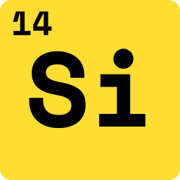

# sc-file

<!-- Links -->

[readme-en]: README.md
[pypi]: https://pypi.org/project/sc-file
[license]: https://opensource.org/licenses/MIT
[tests]: https://github.com/onejeuu/sc-file/actions/workflows/tests.yml
[build]: https://github.com/onejeuu/sc-file/actions/workflows/release.yml
[issues]: https://github.com/onejeuu/sc-file/issues
[releases]: https://github.com/onejeuu/sc-file/releases
[docs]: https://sc-file.readthedocs.io/ru/latest
[contact]: https://onejeuu.t.me

<!-- Documentation -->

[docs-usage]: https://sc-file.readthedocs.io/ru/latest/usage
[docs-library]: https://sc-file.readthedocs.io/ru/latest/api
[docs-faq]: https://sc-file.readthedocs.io/ru/latest/faq.html
[docs-formats]: https://sc-file.readthedocs.io/ru/latest/formats.html
[docs-compile]: https://sc-file.readthedocs.io/ru/latest/compile.html

<!-- Badges -->

[badge-pypi]: https://img.shields.io/pypi/v/sc-file.svg
[badge-license]: https://img.shields.io/github/license/onejeuu/sc-file
[badge-docs]: https://img.shields.io/readthedocs/sc-file
[badge-tests]: https://img.shields.io/github/actions/workflow/status/onejeuu/sc-file/tests.yml?label=tests
[badge-build]: https://img.shields.io/github/actions/workflow/status/onejeuu/sc-file/release.yml?label=build
[badge-issues]: https://img.shields.io/github/issues/onejeuu/sc-file



[![PyPI][badge-pypi]][pypi] [![License][badge-license]][license] [![Docs][badge-docs]][docs] [![Tests][badge-tests]][tests] [![Build][badge-build]][build] [![Issues][badge-issues]][issues]

🇬🇧 [English][readme-en] | 🇷🇺 **Русский**

**scfile** это программа и библиотека для конвертации проприетарных форматов ассетов игры STALCRAFT в стандартные.

> Данный проект является **неофициальным** и **не аффилирован** с EXBO.

## ✨ Поддерживаемые форматы

| Тип                | Форматы игры                             | →   | Стандартные форматы    |
| ------------------ | ---------------------------------------- | --- | ---------------------- |
| 🧊 **Модель**      | `.mcsb`, `.efkmodel`                     | →   | `.obj`, `.glb`, `.fbx` |
| 🌀 **Анимация**    | `.mcvd` + `.mcsb`,<br/>`.mcal` + `.mcsb` | →   | `.glb`                 |
| 🧱 **Текстура**    | `.ol`                                    | →   | `.dds`                 |
| 🗺️ **Тайлы**       | `pda/*.ol`                               | →   | `.jpeg`, `.png`        |
| 🖼️ **Изображение** | `.mic`                                   | →   | `.png`                 |
| 🗃️ **Архив**       | `.texarr`                                | →   | `.zip`                 |
| ⛰️ **Регион**      | `.mdat`                                  | →   | `.mca`                 |
| ⚙️ **NBT**         | `itemnames.dat` `common` `prefs` `sd0-4` | →   | `.json`                |

> [Детальная информация о форматах →][docs-formats]

</br>

> [!IMPORTANT]  
> **Обратная конвертация (`стандартный` → `игровой`) недоступна.**  
> [Подробности в FAQ →][docs-faq]

## 🚀 Использование

### Скачать исполняемый файл

Скачайте `scfile.exe` со [страницы Releases][releases].

**Использование:**

- **Графический интерфейс:** запустите `scfile.exe`.
- **Drag and Drop:** перетащите файлы или папки на `scfile.exe` в Проводнике.
- **Командная строка:** выполните `scfile.exe --help`, чтобы увидеть команды и параметры.

Например:

```console
scfile.exe model.mcsb -F glb --skeleton
```

Эта команда экспортирует модель и её скелет в GLB. \
В [руководстве по использованию][docs-usage] описаны остальные параметры.

### Установить Python пакет

```console
pip install sc-file
pip install sc-file[gui]  # графический интерфейс
```

Базовый пакет включает в себя только библиотеку и CLI.

### Скомпилировать из исходников

Соберите проект из исходного кода по [руководству по сборке][docs-compile].

## 📖 Библиотека

Установите или обновите пакет:

```console
pip install sc-file -U
```

**Пример использования:**

```python
from scfile import convert, formats, Options

# Определить формат исходного файла и конвертировать его
convert.auto("model.mcsb", options=Options(skeleton=True))

# Использовать явную конвертацию и путь вывода
convert.mcsb_to_obj("model.mcsb", "output/model.obj")

# Декодировать известный формат и изучить его данные
with formats.McsbDecoder("model.mcsb") as mcsb:
    model = mcsb.decode()

print([mesh.name for mesh in model.scene.meshes])
print([bone.name for bone in model.scene.skeleton.bones])
```

[Полная документация библиотеки →][docs-library]

## 🔗 Ссылки

- `📚` **Документация:** [sc-file.readthedocs.io][docs]
- `❓` **Остались вопросы?** Ознакомьтесь с [FAQ][docs-faq] или [свяжитесь со мной][contact]
- `🐛` **Нашли баг?** [Создайте issue][issues]
- `💻` **Скачать исполняемый файл:** [Последний релиз][releases]
- `🔧` **Скомпилировать из исходников:** [Руководство по сборке][docs-compile]

## 🤝 Благодарности

`kommunist2021` · `Art3mLapa` · `n1kodim` · `TeamDima` · `BoJIwEbNuK7`  
`IExploitableMan` · `tuneyadecc` · `Hazart`

Спасибо всем, кто сообщал об ошибках, делился находками или вносил идеи.
