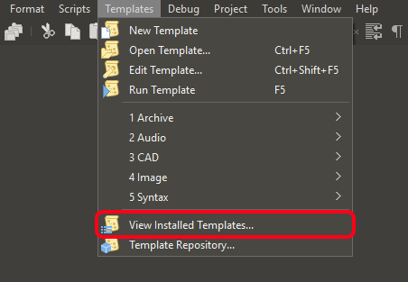
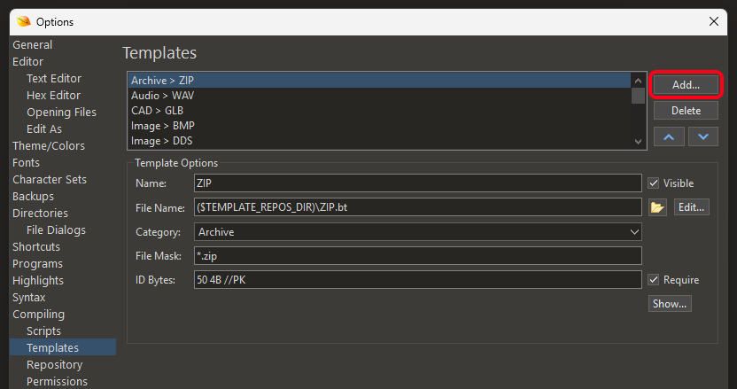
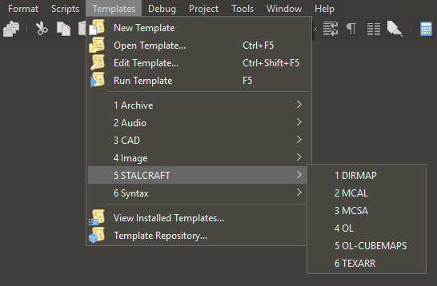

# Binary Templates

Collection of binary templates for [010 Editor](https://www.sweetscape.com/010editor) to parse and analyze game file formats.

## Features

- Game-specific structure definitions
- Syntax highlighting for binary structures
- Named variables for easier analysis

## Usage

Templates **automatically** apply when opening supported game files in editor. \
For manual template selection, use `Templates > STALCRAFT` menu.

> [!NOTE]
> `OL-CUBEMAPS.bt` requires manual selection. \
> Cubemap textures have same `.ol` suffix without unique identifiers.

## Installation

1. Download `.bt` templates file(s).
2. Place in permanent directory (e.g. `~/Documents/SweetScape/010 Templates/Repository/`)
3. Open `Templates > View Installed Templates...`.

    

4. Click `Add`.

    

5. Select downloaded `.bt` file(s) and click `Open`.

---

After installation, verify in `Templates` that `STALCRAFT` group appears:

