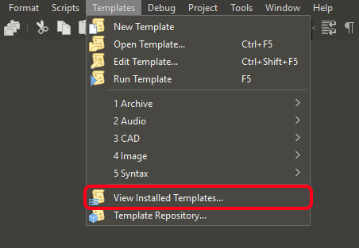
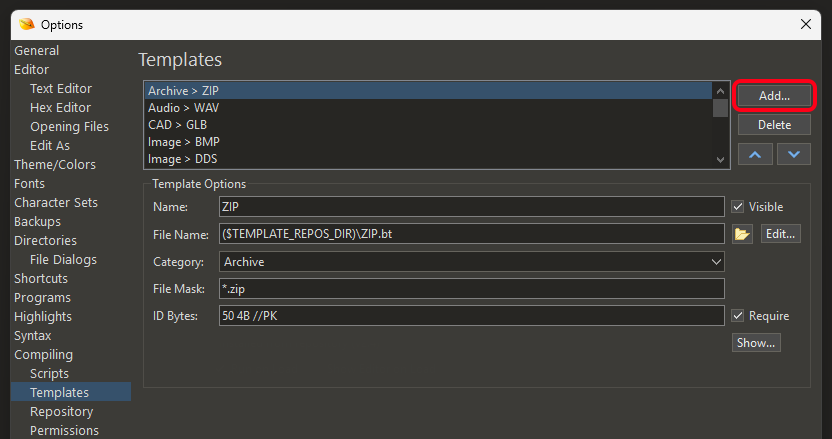
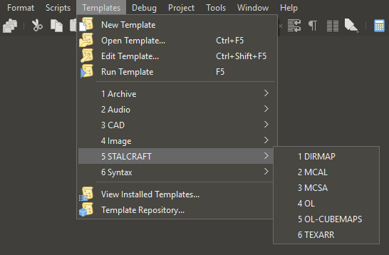

# 010 Editor Binary Templates

[Binary Templates](https://www.sweetscape.com/010editor/templates.html) written for [010 Editor](https://www.sweetscape.com/010editor) to parse and inspect STALCRAFT files.

Each `.bt` file uses the 010 Editor template language to map binary data into named structures, fields, and arrays inside the editor.

> [!WARNING]
> The formats are not official specifications. Templates may contain unknown fields, incomplete structures, or assumptions that change in future game versions.

## Templates

| Template                       | Files                        | Contents                          |
| ------------------------------ | ---------------------------- | --------------------------------- |
| [MCSA.bt](MCSA.bt)             | `*.mcsa`, `*.mcsb`, `*.mcvd` | Models, skeletons, and animations |
| [EFKMODEL.bt](EFKMODEL.bt)     | `*.efkmodel`                 | Effect model geometry             |
| [MCAL.bt](MCAL.bt)             | `*.mcal`                     | Animation libraries               |
| [OL.bt](OL.bt)                 | `*.ol`                       | Textures and cubemaps             |
| [TEXARR.bt](TEXARR.bt)         | `*.texarr`                   | Texture arrays                    |
| [MDAT.bt](MDAT.bt)             | `*.mdat`                     | World region cache                |
| [MDAT.CHUNK.bt](MDAT.CHUNK.bt) | `*.chunk`                    | World chunk data                  |
| [SIGN.bt](SIGN.bt)             | `*.sign`                     | Texture signatures                |
| [HASHMAP.bt](HASHMAP.bt)       | `*.map`                      | Launcher hash mappings            |
| [TORRENT.bt](TORRENT.bt)       | `*.torrent.bin`              | Launcher torrent metadata         |

## Installation

1. Open `Templates > View Installed Templates...` in [010 Editor](https://www.sweetscape.com/010editor).

   

2. Click `Add`.

   

3. Select the downloaded `.bt` files.

After installation, the templates appear under the `STALCRAFT` category:

## Usage

010 Editor applies installed templates by file mask and signature. A template can also be selected manually from `Templates > STALCRAFT`.
